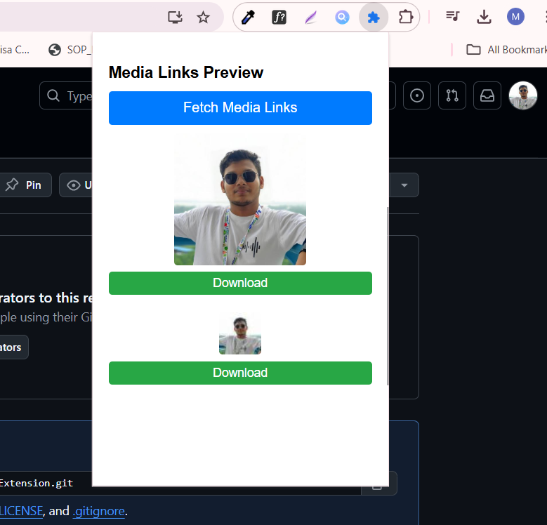

# Media Link Extractor

A **Chrome Extension** that extracts and displays all image and video links from the current webpage. You can also **preview** media files and **download** them directly.

---

## **Features**
- Extracts all image and video links from any webpage.
- Shows a **preview** of images and videos.
- Provides a **download button** for easy media downloads.
- Simple and user-friendly interface.

---

## **Screenshots**

### Popup UI:

---

media-link-extractor:
  icons:                    # Contains extension icons (16x16, 48x48, 128x128)
    - icon16.png
    - icon48.png
    - icon128.png
  content.js:                # Script injected into the webpage to fetch media links
  popup.html:                # Popup UI for the extension
  popup.js:                  # Handles popup actions and displays media links
  styles.css:                # Stylesheet for the popup
  manifest.json:             # Extension configuration file
  README.md:                 # Documentation for the extension

├── styles.css               # Stylesheet for the popup
├── manifest.json            # Extension configuration file
└── README.md                # Documentation for the extension

